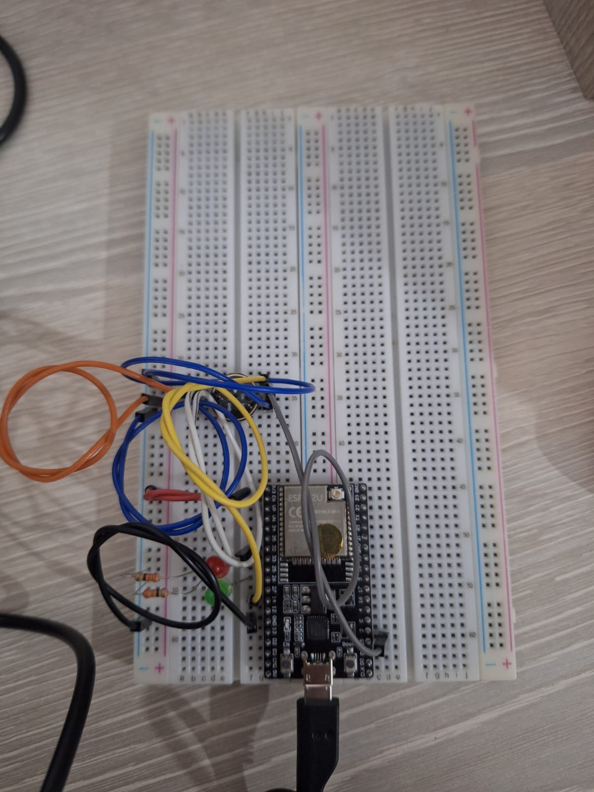

# Montagem Física

Esta montagem conecta um microfone dois LEDs ao ESP32.



## Componentes

- ESP32 DevKit
- Microfone I2S INMP441
- 2 LEDs (vermelho e verde)
- 2 resistores para os LEDs
- Cabos jumper para interconexão
- Protoboard

## Mapa de pinos

- LED vermelho: GPIO 25
- LED verde: GPIO 26
- Microfone SD: GPIO 32
- Microfone SCK: GPIO 14
- Microfone WS: GPIO 15

## Pinagem final esperada

```text
ESP32                Microfone I2S
3V3  ---------------- VDD
GND  ---------------- GND
GPIO32 -------------- SD
GPIO14 -------------- SCK
GPIO15 -------------- WS

ESP32                LED vermelho
GPIO25 --------------|<|-- 220Ω -- GND

ESP32                LED verde
GPIO26 --------------|<|-- 220Ω -- GND
```
